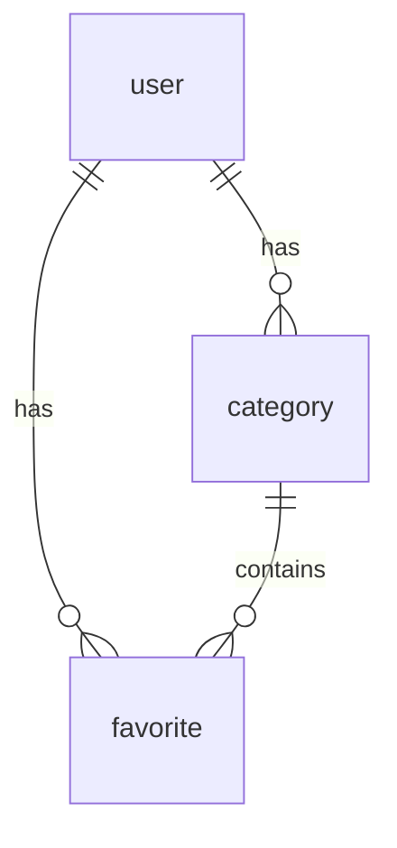

# Database Schema - Context App Multi-User

## Overview
MariaDB schema for the multi-user version of the Context App (landing page with currency, weather, and favorites management).

## Tables

### 1. `user`
Stores user accounts and authentication information.

| Column | Type | Nullable | Default | Description |
|--------|------|----------|---------|-------------|
| id | INT AUTO_INCREMENT | NO | | Primary key |
| username | VARCHAR(50) | NO | | Unique username |
| email | VARCHAR(100) | NO | | Unique email address |
| password_hash | VARCHAR(255) | NO | | bcrypt hashed password |
| is_admin | BOOLEAN | NO | FALSE | Admin privileges flag |
| created_at | TIMESTAMP | YES | CURRENT_TIMESTAMP | Account creation time |
| updated_at | TIMESTAMP | YES | CURRENT_TIMESTAMP ON UPDATE | Last update time |

**Indexes:**
- `PRIMARY KEY` (id)
- `UNIQUE KEY` (username)
- `UNIQUE KEY` (email)
- `idx_username` (username)
- `idx_email` (email)
- `idx_created_at` (created_at)

**Notes:**
- Usernames and emails must be unique
- Passwords are hashed using bcrypt
- Admin users can access the admin panel

### 2. `category`
User-specific categories for organizing favorites.

| Column | Type | Nullable | Default | Description |
|--------|------|----------|---------|-------------|
| id | INT AUTO_INCREMENT | NO | | Primary key |
| user_id | INT | NO | | Foreign key to user.id |
| name | VARCHAR(50) | NO | | Category name (unique per user) |
| color | VARCHAR(7) | YES | '#3498db' | Hex color for UI display |
| display_order | INT | NO | 0 | Order within user's category list |
| created_at | TIMESTAMP | YES | CURRENT_TIMESTAMP | Creation time |
| updated_at | TIMESTAMP | YES | CURRENT_TIMESTAMP ON UPDATE | Last update time |

**Constraints:**
- `UNIQUE KEY uk_user_category` (user_id, name) - Ensures unique category names per user
- `FOREIGN KEY` (user_id) REFERENCES user(id) ON DELETE CASCADE

**Indexes:**
- `PRIMARY KEY` (id)
- `idx_user_id` (user_id)
- `idx_display_order` (display_order)

**Notes:**
- Categories are user-specific (each user has their own set)
- Default categories ("Favoritos", "Tareas Pendientes") are seeded when user registers
- Color field allows UI customization per category

### 3. `favorite`
Stores user's favorite websites and pending tasks.

| Column | Type | Nullable | Default | Description |
|--------|------|----------|---------|-------------|
| id | INT AUTO_INCREMENT | NO | | Primary key |
| user_id | INT | NO | | Foreign key to user.id |
| category_id | INT | YES | NULL | Foreign key to category.id (optional) |
| url | VARCHAR(500) | NO | | Full URL of the website |
| title | VARCHAR(200) | YES | NULL | Display title (from scraping or manual) |
| domain | VARCHAR(100) | NO | | Cleaned domain (for grouping, logos) |
| logo_filename | VARCHAR(255) | YES | NULL | Filename of downloaded logo |
| tipo | ENUM('favorito', 'tarea_pendiente') | YES | 'favorito' | Type: favorite or pending task |
| display_order | INT | NO | 0 | Order within category |
| created_at | TIMESTAMP | YES | CURRENT_TIMESTAMP | Creation time |
| updated_at | TIMESTAMP | YES | CURRENT_TIMESTAMP ON UPDATE | Last update time |

**Constraints:**
- `FOREIGN KEY` (user_id) REFERENCES user(id) ON DELETE CASCADE
- `FOREIGN KEY` (category_id) REFERENCES category(id) ON DELETE SET NULL

**Indexes:**
- `PRIMARY KEY` (id)
- `idx_user_id` (user_id)
- `idx_category_id` (category_id)
- `idx_tipo` (tipo)
- `idx_display_order` (display_order)
- `idx_created_at` (created_at)
- `idx_domain` (domain)

**Notes:**
- `category_id` can be NULL (uncategorized items)
- `tipo` maintains compatibility with existing system
- `logo_filename` references files in `/app/favorites/logos/` directory
- `domain` is cleaned version of URL (without www, protocol) for grouping and logo naming

### 4. `session`
Stores Flask-Session data for user sessions.

| Column | Type | Nullable | Default | Description |
|--------|------|----------|---------|-------------|
| id | INT AUTO_INCREMENT | NO | | Primary key |
| session_id | VARCHAR(255) | NO | | Unique session identifier |
| data | TEXT | NO | | Serialized session data |
| expiry | TIMESTAMP | NO | | Session expiration timestamp |
| created_at | TIMESTAMP | YES | CURRENT_TIMESTAMP | Session creation time |

**Indexes:**
- `PRIMARY KEY` (id)
- `UNIQUE KEY` (session_id)
- `idx_session_id` (session_id)
- `idx_expiry` (expiry)

**Notes:**
- Managed automatically by Flask-Session with SQLAlchemy backend
- Sessions expire after 7 days of inactivity (configurable)

## Relationships



## Default Data

### Categories
When a new user registers, the following default categories are created:

1. **Favoritos** (`#3498db` - blue) - For general favorites
2. **Tareas Pendientes** (`#e74c3c` - red) - For pending tasks

### Default Sites (Optional)
The application can seed default sites for new users (Google, GitHub, etc.) - configured in application code.

## Migration Notes

### From Single-User to Multi-User
The original single-user application used `favorites.json` with the following structure:
```json
{
  "id": "20260311130959",
  "url": "https://www.deepseek.com/",
  "title": "DeepSeek",
  "domain": "www.deepseek.com",
  "logo": "www.deepseek.com_20260311_130958.ico",
  "tipo": "favorito",
  "created_at": "2026-03-11T13:09:59.109372"
}
```

**Migration strategy:**
- Existing `favorites.json` data will NOT be automatically migrated
- New users start with default categories and sites
- Existing users can manually re-add their favorites

## SQL Script Usage

### 1. Apply Schema
```bash
mysql -h [host] -u [user] -p [database] < schema.sql
```

### 2. Verify Tables
```sql
SHOW TABLES;
DESCRIBE user;
```

### 3. Create Admin User (after application start)
Admin users are created through the application's admin panel or by setting `is_admin=TRUE` directly in the database.

## Design Decisions

1. **Cascade Deletes**: When a user is deleted, all their categories and favorites are automatically deleted
2. **SET NULL for category**: When a category is deleted, favorites become uncategorized (category_id = NULL)
3. **ENUM for tipo**: Limited to two values for simplicity, matches existing system
4. **VARCHAR lengths**: Based on realistic data sizes (URLs up to 500 chars, domains up to 100)
5. **UTF8MB4 encoding**: Supports full Unicode including emojis
6. **Timestamps**: `created_at` and `updated_at` for auditing and sorting

## Future Considerations

1. **Tags system**: Additional many-to-many tagging beyond categories
2. **Sharing**: Allow sharing favorites between users
3. **Import/Export**: Bulk operations for user data migration
4. **Soft deletes**: Instead of cascade deletes, add `deleted_at` column for recovery